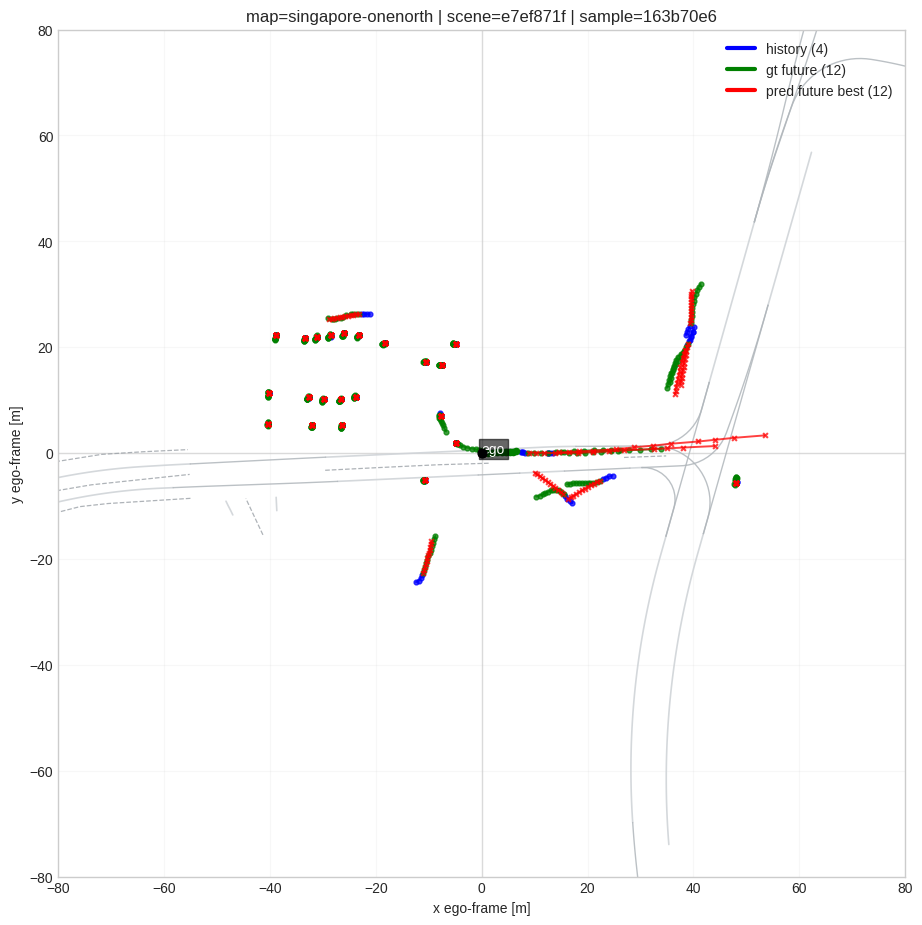

# Motion Prediction V1: Сценовый baseline на nuScenes

Автономный baseline для scene-level multi-agent motion prediction на датасете `nuScenes`. Репозиторий собран вокруг чистого пайплайна с offline-артефактами, локальным контекстом сцены в ego-frame и компактной двухэтапной anchor-based архитектурой.

## Описание

Проект сделан как читаемая и практичная реализация, а не как большой экспериментальный фреймворк. Основная идея простая:

- собирать сценовые обучающие примеры offline
- держать входной контракт модели стабильным и предсказуемым
- явно кодировать локальную геометрию карты и статические объекты
- предсказывать будущее движение через двухэтапный anchor-based decoder

За счёт этого код проще читать, обучать и расширять без старых экспериментальных веток и лишней совместимости.

## Пайплайн данных

Обучение опирается на offline-подготовку артефактов. Вместо того чтобы пересобирать полное представление сцены на каждом training step, проект разделяет preprocessing и model execution:

- доступ к сырым данным `nuScenes` и базовые датасетные утилиты находятся в `data/`
- offline-подготовка артефактов находится в `preprocessing/`
- финальный V1-путь для обучения на готовых артефактах находится в `motion_v1/`

Такой подход ускоряет итерации и делает поведение модели более стабильным, потому что после генерации артефактов batch contract больше не плавает между запусками.

## Архитектура

Модель построена как сценовый baseline с тремя основными идеями:

- история движения агентов кодируется в компактные per-agent токены
- элементы карты и статические объекты кодируются отдельно, а затем объединяются в общее представление сцены
- предсказание будущей траектории делается двухэтапным decoder'ом: сначала определяется ближняя динамика, затем она разворачивается в итоговый forecast

Реализация намеренно оставлена компактной: точка входа для обучения вынесена в `train.py`, а основная V1-логика сосредоточена в небольшом наборе модулей.

## Структура репозитория

```text
motion_nuscenes/
├── motion_v1/
├── data/
├── preprocessing/
├── docs/
├── .gitignore
├── README.md
└── train.py
```

- `motion_v1/` содержит основной V1 dataloader, геометрию, маппинг категорий и модель
- `data/` содержит код для работы с `nuScenes` и датасетные утилиты
- `preprocessing/` содержит offline-препроцессинг и генерацию артефактов
- `train.py` — отдельная точка входа для обучения

## Пример сцены

Ниже показан пример BEV-сцены с историей движения, ground-truth будущим и предсказанной траекторией в ego-frame.



## Замечания

- репозиторий задуман как лёгкий и code-focused
- чекпоинты, сгенерированные артефакты и другие тяжёлые файлы по умолчанию игнорируются
- пути оставлены переносимыми и передаются через аргументы, а не захардкожены под одну машину
