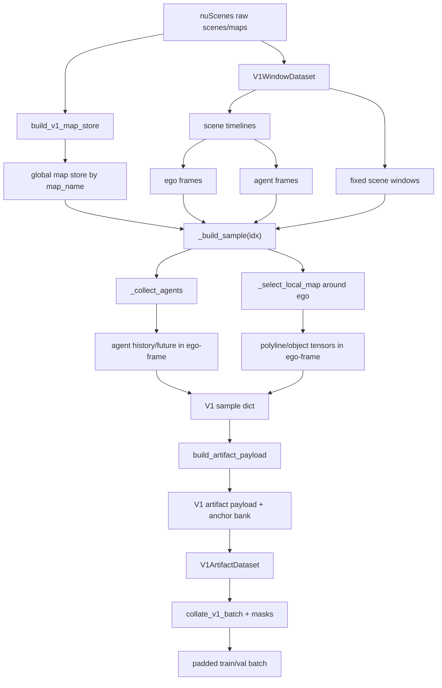
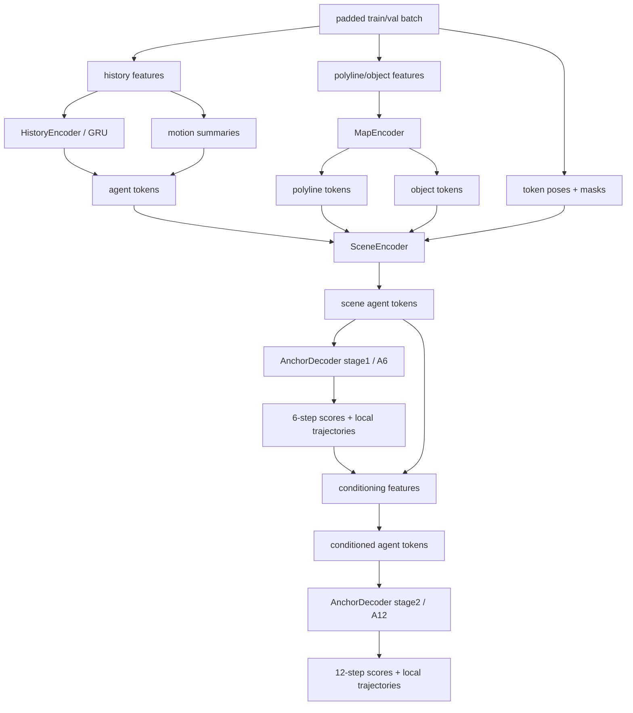
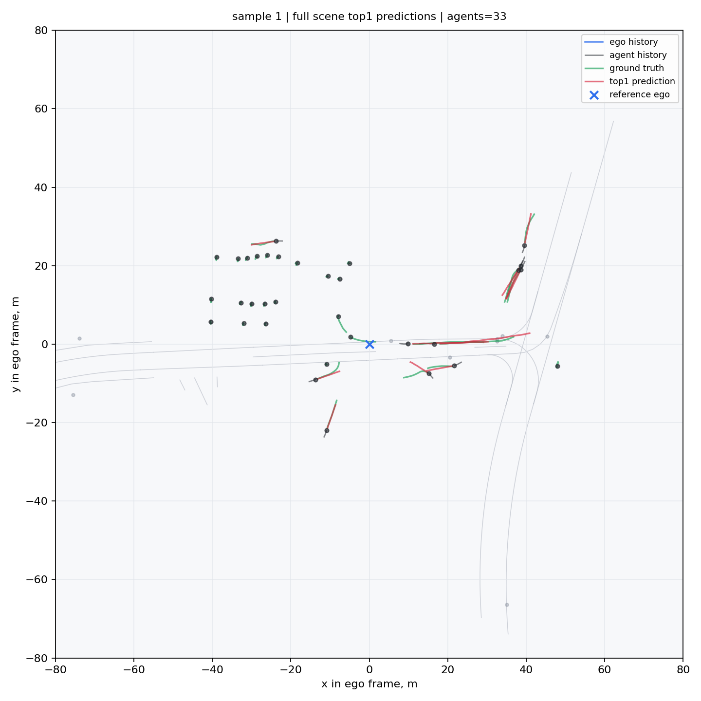
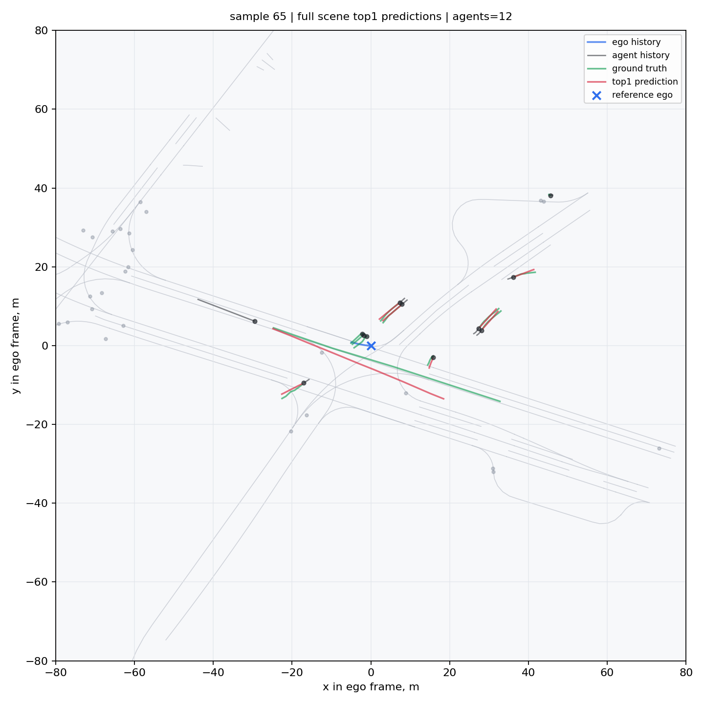

# motion_prediction

Сценовый baseline для multi-agent motion prediction на `nuScenes`.

## Кратко

Один sample соответствует scene window с reference keyframe. Все агенты, объекты карты и полилинии приводятся к ego-frame этого reference frame. Модель предсказывает 12 future steps (`6` секунд, `dt=0.5`) для каждого агента через двухэтапный anchor-based decoder.

## Результаты

Основная validation-метрика из training loop:

| Метрика | Значение |
|---------|----------|
| val top1 ADE | 1.3119 |
| val top1 FDE | 2.9974 |

Дополнительная локальная оценка по всем non-ego агентам из `val_v1_artifact.pt`

| Метрика | Значение |
|---------|----------|
| Top1ADE | 1.0748 |
| MinADE_5 | 0.9396 |
| MinADE_10 | 0.8764 |
| MinFDE_1 | 2.4265 |
| MissRateTopK_2_5 | 0.2055 |
| MissRateTopK_2_10 | 0.1890 |
| num_eval_agents | 26894 |

## Данные

Пайплайн строит V1 artifact payload в `motion_v1/dataloader.py`. В artifact сохраняются готовые scene-level тензоры: history/future агентов, локальная карта, объекты карты, маски и metadata. В текущей версии anchor bank один: k-means++ initialization + k-means refinement по agent-local directional profiles; старые random/kNN варианты не поддерживаются.

Агенты берутся из reference keyframe. Для обучения используются только треки с полной history/future длиной; неполные треки фильтруются.



## Модель

- `HistoryEncoder`: GRU по истории каждого агента.
- `MapEncoder`: кодирует polyline tokens и map object tokens.
- `SceneEncoder`: transformer over agents/map tokens с pose encoding и relative bias.
- `Decoder stage1`: промежуточное 6-step предсказание.
- `Decoder stage2`: финальное 12-step мультимодальное предсказание.

Финальная схема обучает stage1 и stage2 совместно. Отдельный warmup/freeze для stage1 проверялся, но не дал прироста.

Regression обучается на predicted route selection, чтобы train objective был ближе к inference-time выбору mode. Финально используется строгий top-1 routing.



## Примеры



Sample 1 показывает ограничение данных: машины стоят перед barrier, история почти пустая, поэтому модель ожидаемо трактует их как stationary.



Sample 65 показывает ограничение модели: top-1 anchor может быть геометрически близким, но не самым семантически/map-consistent выбором.

## Структура

```text
motion_nuscenes/
├── motion_v1/
│   ├── dataloader.py
│   ├── model.py
│   ├── categories.py
│   ├── geometry.py
│   └── __init__.py
├── data/
│   ├── nuscenes_utils.py
│   └── __init__.py
├── docs/
│   └── assets/
├── train.py
└── README.md
```

## Финальная Конфигурация

| Параметр | Значение |
|----------|----------|
| batch size | 128 |
| lr | 3e-4 |
| dropout | 0.1 |
| stage1 weight | 0.5 |
| stage2 weight | 1.0 |
| train augmentation prob | 0.9 |
| rotation | 10 deg |
| translation | 0.5 m |
| history xy noise | 0.03 m |
| history yaw noise | 1.0 deg |


## Requirements

```text
torch
nuscenes-devkit
numpy
tqdm
shapely
```
