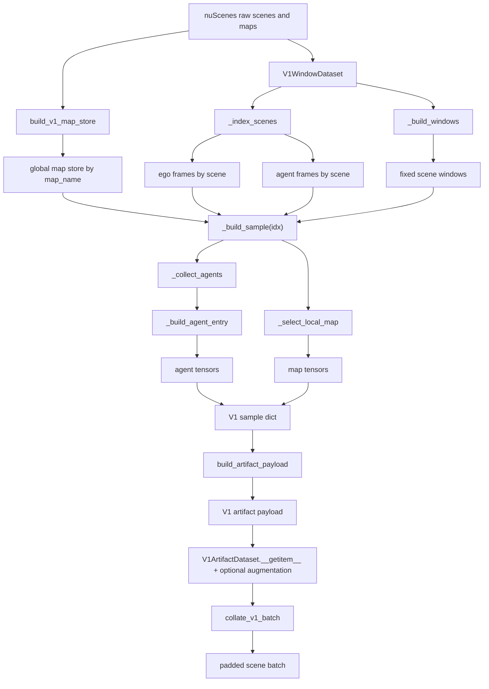
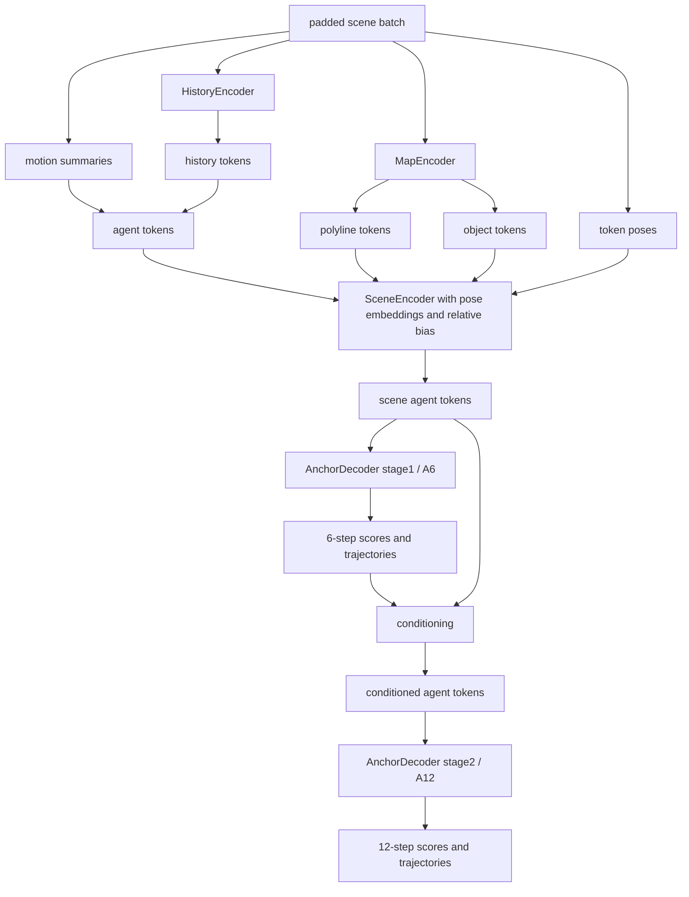

# motion_prediction_v1

Сценовый baseline для multi-agent motion prediction на `nuScenes`.

## Overview

Этот проект собран как чистый и воспроизводимый baseline для предсказания траекторий в сценах автономного вождения. Базовый принцип здесь простой: один sample соответствует одному V1 scene window с reference keyframe, все агенты и элементы карты приводятся к ego-системе координат этого reference frame, а модель работает с полностью подготовленными scene-level тензорами без runtime-достройки пропусков в training loop.

Модель предсказывает `K=64` мультимодальных будущих траекторий для каждого агента на горизонте `6` секунд через двухэтапный anchor-based decoder.

## Results

| Metric | Value |
|--------|-------|
| val top1 ADE | 1.4193 |
| val top1 FDE | 3.2450 |

Лучший результат относится к финальной V1-конфигурации с artifact payload и anchor-based routing.

## Data Pipeline

Artifact build отделяет подготовку данных от обучения. В репозитории поддерживается один контракт данных: V1 artifact payload из `motion_v1/dataloader.py`.



1. `Scene windows`
   Для финального лучшего запуска использовались окна с историей и будущим фиксированной длины.
2. `Agent selection`
   Целевые агенты выбираются из reference keyframe; для каждого собирается фиксированное history+future окно.
3. `Map store`
   Строится один раз на уровень `map_name`; lane/connector/divider геометрия векторизуется заранее, а локальный контекст сцены выбирается вокруг ego-позиции.
4. `Anchor bank`
   Строится k-means++/k-means по agent-local directional profiles и используется как routing-пространство для мультимодального предсказания.
5. `Artifacts`
   Сохраняются на диск, после чего train loader в основном только читает, паддит и возвращает готовые тензоры.

## Architecture



## Loss Configuration

| Parameter | Value |
|-----------|-------|
| soft_anchor_topk | 6 |
| soft_anchor_tau | 0.2 |
| predicted_topk | 3 |
| predicted_anchor_detach | True |
| cls_focal_gamma | 1.5 |
| stationary_cls_weight | 0.4 |
| gt_cond_weight | 0 |

В финальной схеме stage2 обучается на предсказанном выходе stage1, а `detach=True` на mixture-routing помогает не портить классификационную ветку регрессионными градиентами.

## Key Ablations

| Setting | val top1 ADE |
|---------|---------|
| hard WTA | 1.4378 |
| predicted_topk=6 | 1.4262 |
| predicted_topk=3 | 1.4193 |

## Qualitative Example

Ниже показан пример BEV-сцены с историей движения, ground-truth будущим и предсказанной траекторией в ego-frame.


## Requirements

```text
torch
nuscenes-devkit
numpy
tqdm
shapely
```

## Project Structure

`motion_v1` содержит единственный актуальный пайплайн: сборку V1 artifact payload, dataloader, модель, loss и геометрические утилиты. `data` оставлен только для небольших `nuScenes`-специфичных helper-функций, которые нужны V1-загрузчику.

```text
motion_nuscenes/
├── motion_v1/               # модель, V1 dataloader и базовые геометрические утилиты
│   ├── dataloader.py
│   ├── model.py
│   ├── categories.py
│   ├── geometry.py
│   └── __init__.py
├── data/                    # nuScenes utilities для V1 dataloader
│   ├── nuscenes_utils.py
│   └── __init__.py
├── docs/
│   └── assets/
│       └── bev_example.png
├── .gitignore
├── README.md
└── train.py
```
